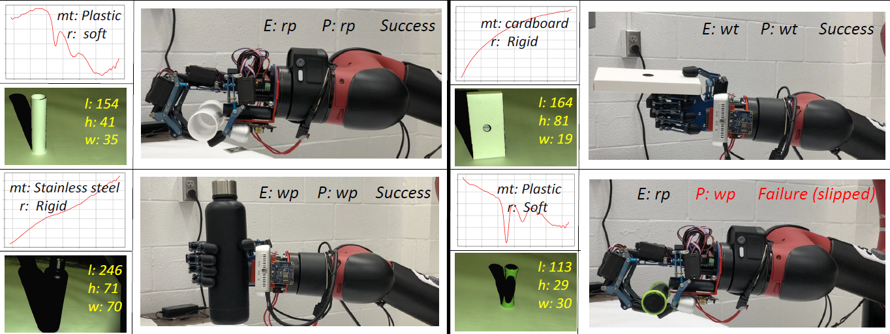
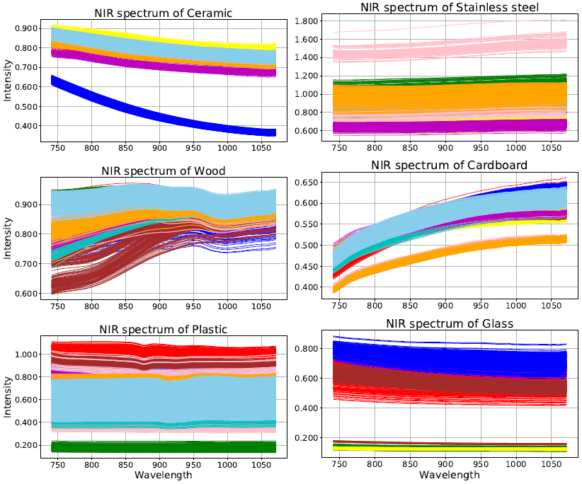
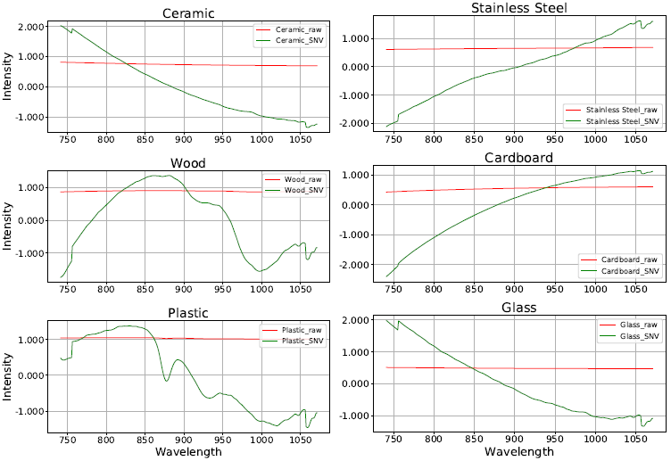
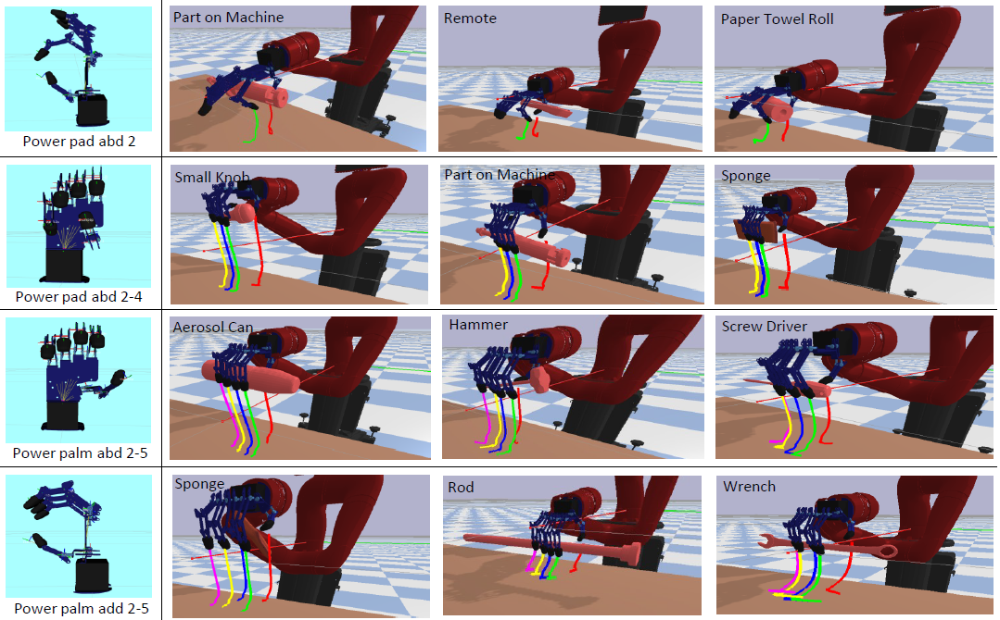
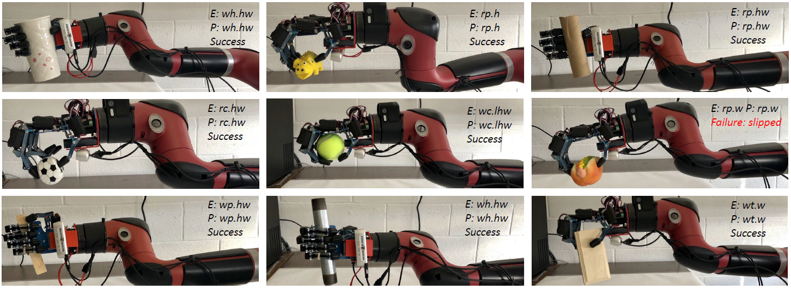
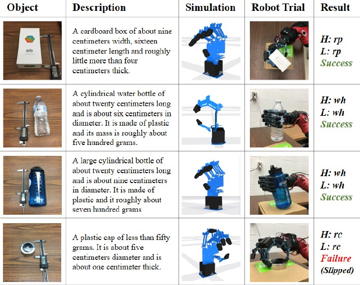
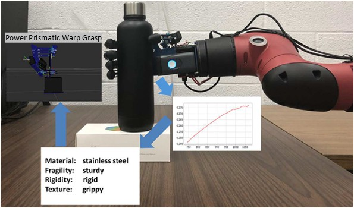

# Overview
Near-Infrared Spectroscopy (NIR or NIRS) enables material analysis at the molecular level. It penetrates samples deeply with minimal preparation and allows simultaneous, high-precision measurements. Unlike traditional chemical methods, NIR offers faster results, operates effectively in low-light conditions, and enables real-time analysis without damaging the sample. Material recognition can help infer key object properties such as stiffness, friction, and weight—critical features for enabling precise and adaptive robotic manipulation.

 

# NIR_dataset
We constructed a near-infrared (NIR) spectral dataset comprising common daily-use objects across six material categories: ceramic, wood, plastic, cardboard, stainless steel, and glass. For ceramic, wood, plastic, and cardboard, ten objects per category were selected, while nine stainless steel and five glass objects were included. Each object contributed ten samples for spectral measurement. For larger items such as plates, pans, and cardboard boxes, approximately 30 scans per sample were collected, whereas smaller objects like spoons, forks, and plastic cups had fewer scans. In total, the dataset consists of 15,936 spectra, capturing a diverse range of material characteristics for NIR analysis.

 

# Data Preporcessing

Standard Normal Variate (SNV) is used to preprocess the data to improve the performance of the material recognition algorithm.

# Material Recognition

A sample Multilayer Perceptron (MLP) deep learning network, implemented in *nir_mlp.py* using PyTorch, is provided as a baseline model for material classification using the collected NIR spectral dataset. A Bayesian neural network is also included for classifying the NIR spectra.

# Publications

This dataset is used in the following paper

## Learning Task-Oriented Dexterous Grasping from Human Knowledge
This paper proposes a task-oriented dexterous grasping framework that enables robots to learn and adapt grasp strategies based on human experience, object affordances, and task requirements. Grasp topologies are defined and learned from a task-oriented dataset, while a reinforcement learning-based policy enables context-aware strategy deployment. Evaluated using a simulated environment with an AR10 hand on a Sawyer robot, the system achieved a 100% hit rate for grasp strategies, a 95.6% top-3 match rate, and an 85.6% grasp success rate across 2,700 manipulation tasks guided by natural-language instructions.

 

    @inproceedings{li2021learning,
      title={Learning Task-Oriented Dexterous Grasping from Human Knowledge},
      author={Li, Hui and Zhang, Yinlong and Li, Yanan and He, Hongsheng},
      booktitle={2021 IEEE International Conference on Robotics and Automation (ICRA)},
      pages={6192--6198},
      year={2021},
      organization={IEEE}
    }

[[download paper](https://ieeexplore.ieee.org/abstract/document/9562073)]

## MagicHand: Context-Aware Dexterous Grasping Using an Anthropomorphic Robotic Hand

This paper presents a context-aware anthropomorphic robotic hand system, MagicHand, which gathers multimodal information about target objects and generates appropriate grasping strategies accordingly. The system leverages Near-Infrared (NIR) spectroscopy to recognize material properties at the molecular level and uses RGB-D images to estimate object dimensions. Six commonly used grasping poses are defined, and the system selects the most suitable grasp strategy based on the perceived object characteristics.

 

    @inproceedings{li2020magichand,
      title={MagicHand: Context-Aware Dexterous Grasping Using an Anthropomorphic Robotic Hand},
      author={Li, Hui and Tan, Jindong and He, Hongsheng},
      booktitle={2020 IEEE International Conference on Robotics and Automation (ICRA)},
      pages={9895--9901},
      year={2020},
      organization={IEEE}
    }

[[download paper](https://ieeexplore.ieee.org/document/9196538)]

## Learning robotic grasping strategy based on natural-language object descriptions
This paper presents a learning-based approach for determining grasping strategies for an anthropomorphic robotic hand using natural-language descriptions of objects. A customized natural language processing technique is used to extract object features, which are then mapped to appropriate grasp types based on a human grasp taxonomy. The proposed method is evaluated through both simulation and real-world experiments using an AR10 robotic hand, demonstrating its effectiveness in generating suitable grasp strategies from linguistic input.

 

    @inproceedings{rao2018learning,
      title={Learning robotic grasping strategy based on natural-language object descriptions},
      author={Rao, Achyutha Bharath and Krishnan, Krishna and He, Hongsheng},
      booktitle={2018 IEEE/RSJ International Conference on Intelligent Robots and Systems (IROS)},
      pages={882--887},
      year={2018},
      organization={IEEE}
    }

[[download paper](https://ieeexplore.ieee.org/document/8593886)]

## Magichand: In-hand perception of object characteristics for dexterous manipulation

This paper addresses a key challenge in dexterous grasping: perceiving object characteristics such as fragility, rigidity, texture, mass, and density. A novel method is proposed that classifies Near-Infrared (NIR) spectra to identify object materials and infer their physical properties using a material-to-characteristics lookup table. NIR data from six materials—ceramic, stainless steel, wood, cardboard, plastic, and glass—were collected using a SCiO sensor and classified using a Multi-Layer Perceptron (MLP) neural network, achieving 99.96% accuracy. A grasping experiment with objects of similar shape but different materials demonstrated that the robotic hand could adapt its grasp strategy based on the perceived material characteristics, validating the effectiveness of the proposed approach.

 

    @inproceedings{li2018magichand,
      title={Magichand: In-hand perception of object characteristics for dexterous manipulation},
      author={Li, Hui and Yihun, Yimesker and He, Hongsheng},
      booktitle={Social Robotics: 10th International Conference, ICSR 2018},
      pages={523--532},
      year={2018},
      organization={Springer}
    }

[[download paper](https://link.springer.com/chapter/10.1007/978-3-030-05204-1_51)]